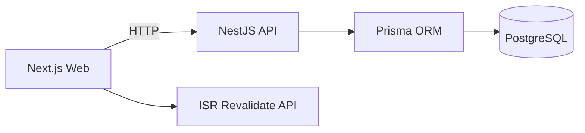

# Mini Blog — Next.js + NestJS + Prisma + PostgreSQL (Monorepo)

โปรเจกต์ Mini Blog สำหรับใช้เป็น Portfolio โชว์สกิล Full‑Stack ตาม JD: โครงสร้างแบบ Monorepo, หน้าเว็บ SSR/ISR, API มาตรฐาน, Prisma ORM, CI พร้อม และคำแนะนำดีพลอยสาธารณะ

## ภาพรวม
- เว็บ (Next.js App Router) เร็วและพร้อม SEO: SSR รายการบทความ, ISR รายบทความ, JSON‑LD, sitemap, robots
- API (NestJS) แบบโมดูลชัดเจน, DTO validation, error handling, Prisma schema + migration + seed
- Database: PostgreSQL (Docker compose dev), สคีมา `Post` ครอบคลุมสถานะ draft/published/archived
- Revalidate: มี API ฝั่งเว็บสำหรับ on‑demand revalidation (tag/path) หลังการแก้ไขคอนเทนต์

## โครงสร้างโมโนรีโป
```
.
├─ apps/
│  ├─ api/              # NestJS API (Prisma, Posts module, Dockerfile)
│  └─ web/              # Next.js (App Router, SSR/ISR, admin pages)
├─ docker-compose.yml   # Postgres dev service
├─ pnpm-workspace.yaml  # กำหนด workspaces
├─ .github/workflows/ci.yml
└─ README.md            # ไฟล์นี้
```

### สถาปัตยกรรม (ย่อ)


## ฟีเจอร์หลัก
- CRUD บทความครบ: เพิ่ม/แก้ไข/ลบ (หน้า admin), อ่านบทความ (public)
- รายการบทความ (SSR + tag cache)
- หน้าบทความ (ISR + JSON‑LD) พร้อม revalidate on‑demand เมื่อมีการแก้ไข/เผยแพร่
- Validation/Errors: ปลอดภัยและสื่อความหมาย
- CI: ลินต์/บิลด์อัตโนมัติบน GitHub Actions

## วิธีรัน (Dev)
1) ฐานข้อมูล
```bash
docker compose up -d db
```
2) ติดตั้งและเตรียมฐานข้อมูล
```bash
pnpm install
pnpm -C apps/api prisma:migrate
pnpm -C apps/api prisma:seed
```
3) รันแยกสองโปรเซส
```bash
pnpm -C apps/api start:dev   # http://localhost:4000
pnpm -C apps/web dev         # http://localhost:3000
```

## Endpoints สำคัญ (API)
- GET `/posts?status=PUBLISHED&take=20&tag=nextjs&q=keyword` — รายการบทความ + ตัวกรองพื้นฐาน
- GET `/posts/:slug` — รายละเอียดบทความ (ใช้ ISR ฝั่งเว็บ)
- GET `/posts/id/:id` — ใช้ในหน้าแก้ไข (admin)
- POST `/posts` — สร้าง (แนะนำให้ป้องกันด้วย guard เมื่อโปรดักชัน)
- PATCH `/posts/:id` — แก้ไข
- DELETE `/posts/:id` — ลบ

## Revalidation (ฝั่งเว็บ)
- POST `/api/revalidate` body: `{ tag?: string, slug?: string }`
  - `tag: 'posts'` จะ revalidate หน้า Home (รายการ)
  - `slug` จะ revalidate เส้นทาง `/posts/[slug]`

## ดีพลอยสาธารณะ (แนะนำ)
- API (Render)
  - Root: `apps/api`
  - Build: `pnpm -C apps/api build`
  - Start: `pnpm -C apps/api start:prod`
  - Env: `DATABASE_URL`, `PORT=4000`, `CORS_ORIGINS=https://<your-web>.vercel.app`
- Web (Vercel)
  - Root: `apps/web`
  - Env: `NEXT_PUBLIC_API_BASE=https://<render-api>.onrender.com`, `NEXT_PUBLIC_SITE_BASE=https://<your-web>.vercel.app`

## ทดสอบประสิทธิภาพ (ตัวอย่าง)
```bash
npx autocannon -c 30 -d 20 http://localhost:4000/posts
```
หรือ `k6` ดูตัวอย่างโค้ดในส่วน “สคริปต์ทดสอบโหลด” ของ README นี้

## หมายเหตุ
- โปรดเพิ่มการพิสูจน์ตัวตน/สิทธิ์ (AuthN/AuthZ) สำหรับใช้งานสาธารณะ
- สามารถเพิ่ม Logs/Tracing และ Tests เพื่อยกระดับความน่าเชื่อถือได้ตามโจทย์จริง
