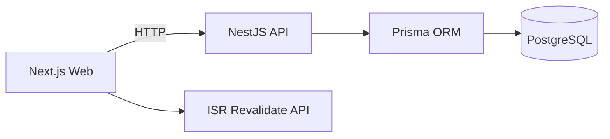

# Mini Blog — Next.js + NestJS + Prisma + PostgreSQL (Monorepo)

ระบบ Mini Blog แยก Web/API ชัดเจนในรูปแบบ Monorepo รองรับการอ่านบทความสาธารณะ (SSR/ISR) และพื้นที่ผู้เขียนสำหรับสร้าง/แก้ไข/ลบ (JWT)

## ภาพรวมและวัตถุประสงค์

- Web (Next.js App Router): หน้ารายการบทความ (SSR), หน้าบทความ (ISR + JSON‑LD), sitemap/robots, พื้นที่ผู้เขียนและแบบฟอร์มบริหารบทความ
- API (NestJS): โมดูล Auth/Posts/Prisma, DTO validation, error handling, LoggingInterceptor, JWT guard, Prisma schema/migration/seed
- Database: PostgreSQL (docker compose สำหรับ dev)
- Revalidation: API ฝั่ง Web สำหรับสั่ง revalidate ทั้ง tag และ path หลัง CRUD

## โครงสร้างโมโนรีโป

```
.
├─ apps/
│  ├─ api/              # NestJS API (Prisma, Posts module, Dockerfile)
│  └─ web/              # Next.js (App Router, SSR/ISR, admin pages)
├─ docker-compose.yml   # Postgres dev service
├─ pnpm-workspace.yaml  # workspaces
├─ .github/workflows/ci.yml
└─ README.md
```

### สถาปัตยกรรม (ย่อ)



## การออกแบบข้อมูลและการทำงาน

- Prisma models:
  - `User { id, email(unique), passwordHash, name, role(ADMIN|USER), createdAt, updatedAt }`
  - `Post { id, title, slug(unique), excerpt?, content, tags[], status(DRAFT|PUBLISHED|ARCHIVED), publishedAt?, authorId?, createdAt, updatedAt }`
- สิทธิ์การเข้าถึง:
  - อ่าน (GET): public
  - แก้ไข (POST/PATCH/DELETE): ต้องมี JWT (AuthGuard)
- กลยุทธ์แคช/SEO:
  - Home: SSR + tag `posts`
  - รายบทความ: ISR (`revalidate = 300`) + JSON‑LD + OG
  - on‑demand revalidate ที่ `POST /api/revalidate`

## ฟีเจอร์หลัก

- อ่านบทความ (public)
- พื้นที่ผู้เขียน: login (JWT), สร้าง/แก้ไข/ลบ พร้อม revalidate
- API คุณภาพ: DTO validation, error handling, logging
- CI: ลินต์/บิลด์อัตโนมัติบน GitHub Actions

## วิธีรัน (Dev)

1) เริ่มฐานข้อมูล

```bash
docker compose up -d db
```

2) ติดตั้งและเตรียมฐานข้อมูล

```bash
pnpm install
pnpm -C apps/api prisma:migrate
pnpm -C apps/api prisma:seed
```

3) รันเว็บและ API

```bash
pnpm -C apps/api start:dev   # http://localhost:4000
pnpm -C apps/web dev         # http://localhost:3000
```

## Endpoints (คัดมาเฉพาะสำคัญ)

- GET `/posts?status=PUBLISHED&take=20&tag=nextjs&q=keyword`
- GET `/posts/:slug`
- GET `/posts/id/:id`
- GET `/posts/admin` (request login / JWT)
- POST `/posts` (request login / JWT)
- PATCH `/posts/:id` (request login / JWT)
- DELETE `/posts/:id` (request login / JWT)

## Revalidation (Web)

- POST `/api/revalidate` body: `{ tag?: string, slug?: string }`

## ดีพลอยสาธารณะ (ย่อ)

- API (เช่น Render)
  - Root: `apps/api`
  - Build: `pnpm -C apps/api build`
  - Start: `pnpm -C apps/api start:prod`
- Web (Vercel)
  - Root: `apps/web`
